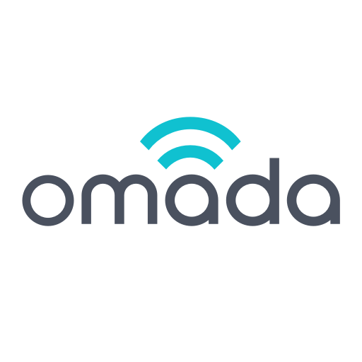

# ioBroker.omadav2

**Tests:** 

## OmadaV2 Adapter für ioBroker

**Enhanced Adapter für TP-Link Omada Controller**

Dieser Adapter ist ein Fork des ursprünglichen [ioBroker.omada](https://github.com/TA2k/ioBroker.omada) Adapters von [TA2k](https://github.com/TA2k) mit zusätzlichen Funktionen und Verbesserungen.

**Original-Autor:** [TA2k](https://github.com/TA2k) - Vielen Dank für die großartige Basis!

## 🚀 Neue Features (geplant)

- **Erweiterte Monitoring-Funktionen**
- **Verbesserte SSID-Steuerung**
- **VLAN-Management**
- **QoS-Konfiguration**
- **Erweiterte Client-Statistiken**
- **Dashboard-Widgets**

## 📋 Voraussetzungen

- ioBroker Installation
- TP-Link Omada Controller (Software oder Hardware)
- Node.js >= 14

## ⚙️ Installation

1. Adapter über ioBroker Admin installieren
2. Instanz erstellen und konfigurieren
3. Omada Controller-Daten eingeben:
   - **IP-Adresse** des Omada Controllers
   - **Port** (Standard: 8043 für Software Controller, 443 für Hardware Controller)
   - **Benutzername** und **Passwort**
   - **Update-Intervall** (Standard: 30 Sekunden)

## 🔧 Konfiguration

### Loginablauf

Die Omada IP, Login und Passwort eingeben.
Default Port für Hardware Controller ist 443

### Steuerung

SSID-Einstellungen können via `omadav2.0.id.ssids` geändert werden

## 📊 Unterstützte Daten

- **Clients** (verbundene Geräte)
- **WLANs** (Wireless Networks)
- **Devices** (Omada Hardware)
- **Insights** (Client-Statistiken)
- **Alerts** (Warnungen)
- **Dashboard Overview** (Übersichtsdaten)

## 🔄 Unterschiede zum Original

| Feature | Original | OmadaV2 |
|---------|----------|---------|
| Basis-Funktionalität | ✅ | ✅ |
| Erweiterte Monitoring | ❌ | ✅ (geplant) |
| VLAN-Management | ❌ | ✅ (geplant) |
| QoS-Steuerung | ❌ | ✅ (geplant) |
| Dashboard-Widgets | ❌ | ✅ (geplant) |

## 🤝 Beitragen

Beiträge sind willkommen! Bitte erstelle ein Issue oder einen Pull Request.

## 📝 Changelog

### 0.0.1 (OmadaV2)
- (Flyor) Initial release of OmadaV2
- Forked from original ioBroker.omada adapter by TA2k
- Enhanced structure and planning for additional features

### Original Changelog (ioBroker.omada by TA2k)
- 0.0.7: Fix for omadaId
- 0.0.6: Fix relogin after 24h  
- 0.0.3: Fix client fetching
- 0.0.1: Initial release by TA2k

## 📄 Lizenz

MIT License

Copyright (c) 2024 Flyor <flyor@example.com>

Permission is hereby granted, free of charge, to any person obtaining a copy
of this software and associated documentation files (the "Software"), to deal
in the Software without restriction, including without limitation the rights
to use, copy, modify, merge, publish, distribute, sublicense, and/or sell
copies of the Software, and to permit persons to whom the Software is
furnished to do so, subject to the following conditions:

The above copyright notice and this permission notice shall be included in all
copies or substantial portions of the Software.

THE SOFTWARE IS PROVIDED "AS IS", WITHOUT WARRANTY OF ANY KIND, EXPRESS OR
IMPLIED, INCLUDING BUT NOT LIMITED TO THE WARRANTIES OF MERCHANTABILITY,
FITNESS FOR A PARTICULAR PURPOSE AND NONINFRINGEMENT. IN NO EVENT SHALL THE
AUTHORS OR COPYRIGHT HOLDERS BE LIABLE FOR ANY CLAIM, DAMAGES OR OTHER
LIABILITY, WHETHER IN AN ACTION OF CONTRACT, TORT OR OTHERWISE, ARISING FROM,
OUT OF OR IN CONNECTION WITH THE SOFTWARE OR THE USE OR OTHER DEALINGS IN THE
SOFTWARE.